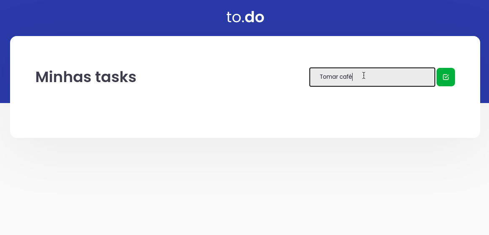
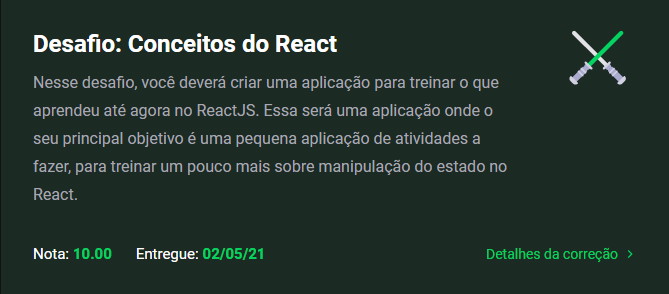

  

<h1 align="center">
  to.do
</h1>

Desafio 01 - Conceitos do React

## Desafio proposto

> O seu principal objetivo é uma pequena aplicação de atividades a fazer, para treinar um pouco mais sobre manipulação do estado no React.

### Requisitos

- [x] Adicionar uma nova tarefa
- [x] Remover uma tarefa
- [x] Marcar e desmarcar uma tarefa como concluída

## 👨‍🎓 Nota
